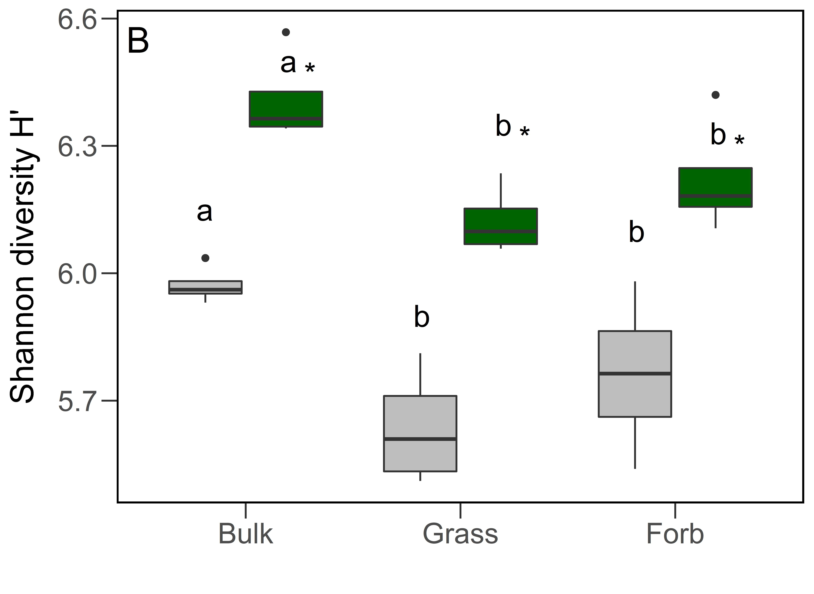
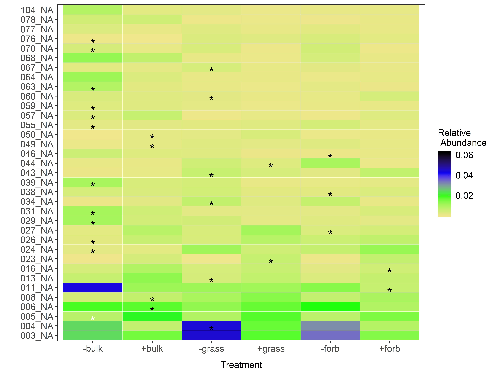
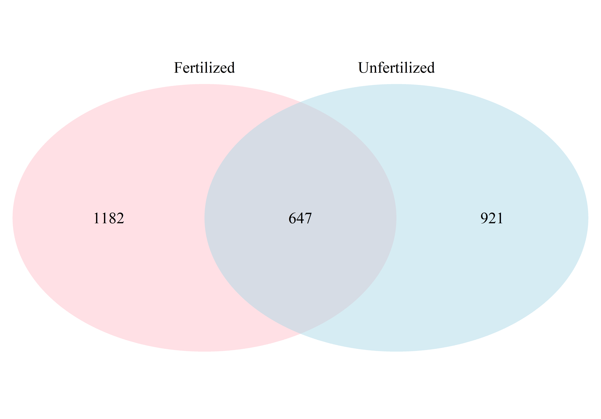
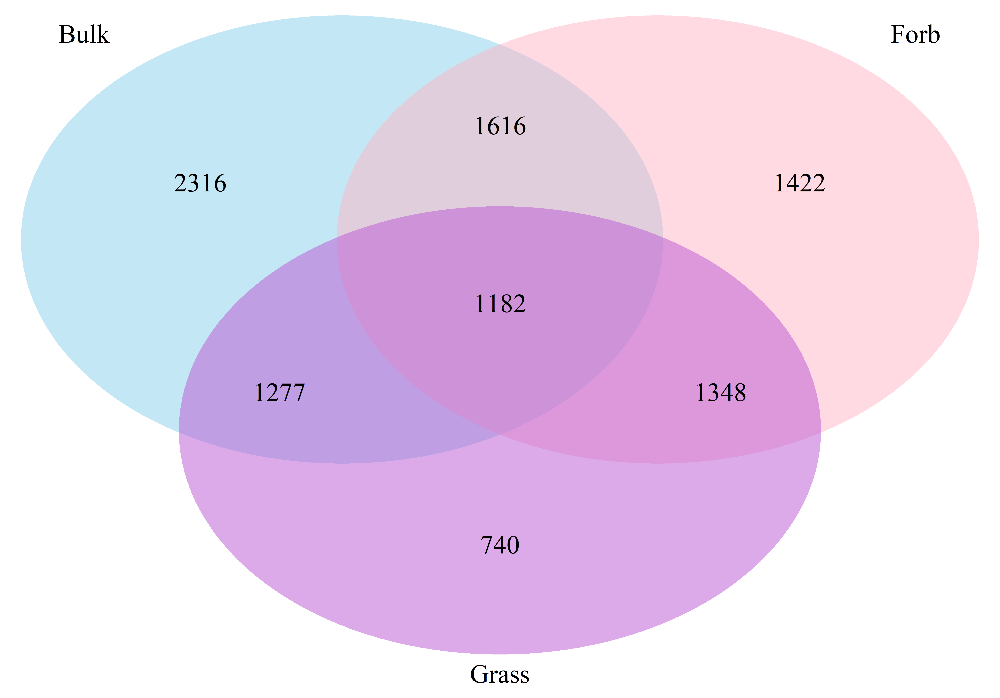
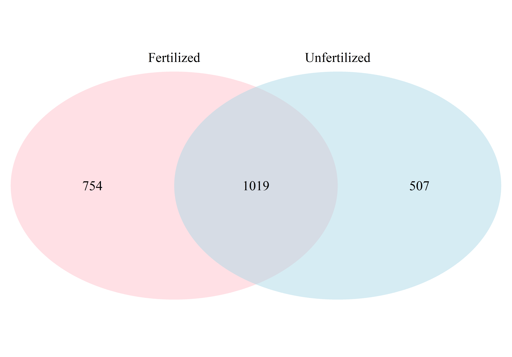

> 📦 **源代码**: [GitHub 仓库](https://github.com/luWheeler/WRC15-)

# 一、研究背景

本报告基于16S rRNA测序数据，分析不同处理（Treatment）下WRC15根际微生物群落的α、β多样性差异，探究处理方式对根际微生物群落结构的影响。

# 二、数据与方法

## 2.1 数据来源

本研究的测序数据来自WRC15根际微生物样本，共包含不同处理组的40个样本，元数据文件为`2015_WestResearchCampus_Sampling_Rhizo.csv`。

## 2.2 分析方法

- **α多样性分析**：计算Shannon、Richness指数，采用Kruskal-Wallis检验组间差异，Dunn检验进行事后多重比较。
- **β多样性分析**：基于Bray-Curtis距离矩阵进行PCoA排序，PERMANOVA检验组间群落结构差异。

# 三、结果与分析

## 3.1 α多样性分析

### 3.1.1 Shannon多样性指数

不同处理组的Shannon多样性指数存在显著差异（Kruskal-Wallis检验，p < 0.05），说明处理方式显著影响了微生物群落的物种多样性。

### 3.1.2 Richness指数

## 3.2 β多样性分析

基于Bray-Curtis距离的PCoA排序显示，不同处理组的微生物群落存在明显的分群，PERMANOVA检验表明组间群落结构差异显著（p < 0.05）。

## 3.3 物种组成分析

### 门水平组成

###纲水平组成

## 3.4 指示物种分析

## 3.5 维恩图分析

::: {layout-ncol=2}

:::

::: {layout-ncol=2}

:::

# 四、结论

1.  不同处理方式显著影响了根际微生物群落的α多样性，Shannon指数和Richness指数在组间存在显著差异。
2.  β多样性分析表明，处理方式显著改变了微生物群落的整体结构，不同处理组的群落明显分离。
3.  物种组成分析显示，不同处理组在门和纲水平上存在明显的组成差异。
4.  指示物种分析和维恩图进一步揭示了各处理组的特异性微生物类群。
